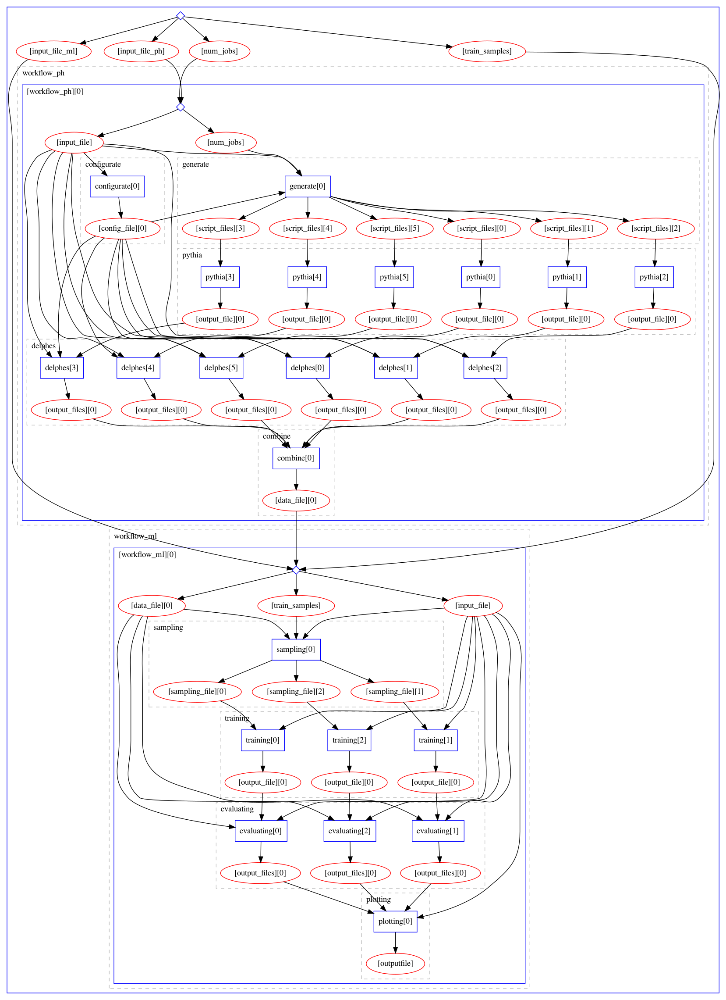

# REANA Introduction

Thus far, the tutorial described running the various steps on your local computer. In the interest of time, we did not generate
much training data, but in case of serious research, we would need to generate more data for both training and evaluation. 
For this, you will probably want to run these jobs on a cluster. You may also want to compare various methods or tune
the hyperparameters for the Machine Learning models and training steps.

Furthermore, the MadMiner tutorial involved several steps (_event generation_, _detector simulation_, _models training_,
_models evaluation_...). To streamline this, we have integrated MadMiner into the [REANA][reana-web] workflow execution system
and defined a workflow using the Yadage specification language. 

Integrating MadMiner into REANA allows us to scale the tutorial to large numbers of events and large parameter scans.
This work was supported by the [SCAILFIN][scailfin-web] initiative (_Scalable CyberInfrastructure for Artificial Intelligence
and Likelihood Free Inference_) and [IRIS-HEP][iris-hep-web].

The workflow contains all the necessary elements to be run either:
- Locally (making use of the [Yadage][yadage-docs] workflow engine).
- Remotely (making use of the [REANA][reana-web] platform).
  
It also integrates with a metrics tracking system called [MLFlow][mlflow-web], that can, optionally, save certain
Machine Learning metrics from run to run.

## Technologies
Before jumping the different commands to execute the workflow, some words about the underlying technologies:

- **Docker**: used to encapsulate and isolate the environment around the snippets of code that the workflow steps use to interact with Madminer. See note below.
- **Yadage**: defines the workflow specification language, which the MadMiner workflow is written in. You can edit YAML files to change the settings for the various stages of the workflow. It also includes a command line interface (CLI) tool that coordinates the execution of computational workflows locally.
- **REANA**: a cloud-based platform that coordinates the execution of computational workflows remotely. It can be used to scale up the workflow by distributing computation. It also supports high-performance computing (HPC) backends, so one can deploy REANA on an HPC cluster at a university or lab. Technically, REANA can be [installed locally][reana-docs-local], but that is not its intended usage.
- **MLFlow**: an external component used to store and track certain metrics of the Machine Learning part of the workflow, thanks to the use of its tracking user interface (UI). It is not part of the `madminer-workflow` itself, so **its usage is optional**.

### Clarification: Docker images
The Docker images used within the workflow have been already built and pushed to the [Madminer DockerHub account][madminer-dockerhub].
Those images are of general purpose, and their maintenance / evolution remains a responsibility of the `madminer-workflow` developers,
not the users.

## Workflow stages
Below is an image of a full MadMiner workflow (the largest blue box), which includes the two sub-workflows:

- **Physics sub-workflow**: responsible for event generation with MadGraph and Delphes simulation running
  at multiple EFT parameter points. It is followed by a combine step that produces a single large data file.
- **ML sub-workflow**: responsible for the ML portions. It starts with a sampling the combined data file 
  for training data, follower by three training runs (_SALLY_, _ALICE_, and _ALICES_ methods), the evaluation
  of each of the three trained models, and the results plotting.

This is the workflow diagram in the `madminer-workflow` repository. In the section titled [Parametrization][reana-guide-param],
we describe how to modify the workflow's configuration files for your own research purposes.

[iris-hep-web]: https://iris-hep.org
[mlflow-web]: https://mlflow.org
[madminer-dockerhub]: https://hub.docker.com/u/madminertool
[reana-docs-local]: https://docs.reana.io/administration/deployment/deploying-locally
[reana-guide-param]: 3_parametrization.md
[reana-web]: https://reanahub.io
[scailfin-web]: https://scailfin.github.io
[yadage-docs]: https://yadage.readthedocs.io/en/latest
