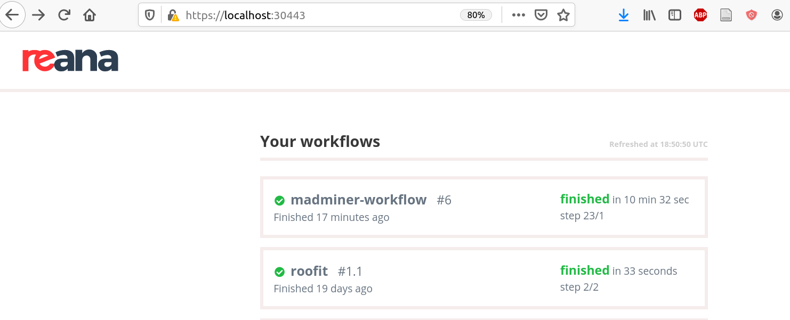
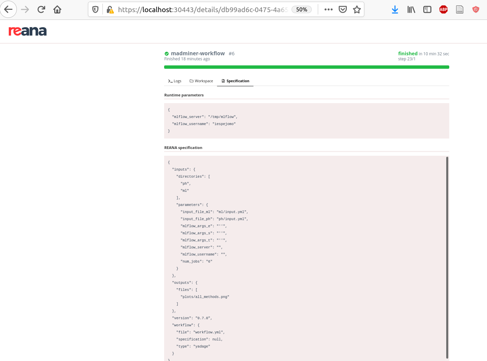
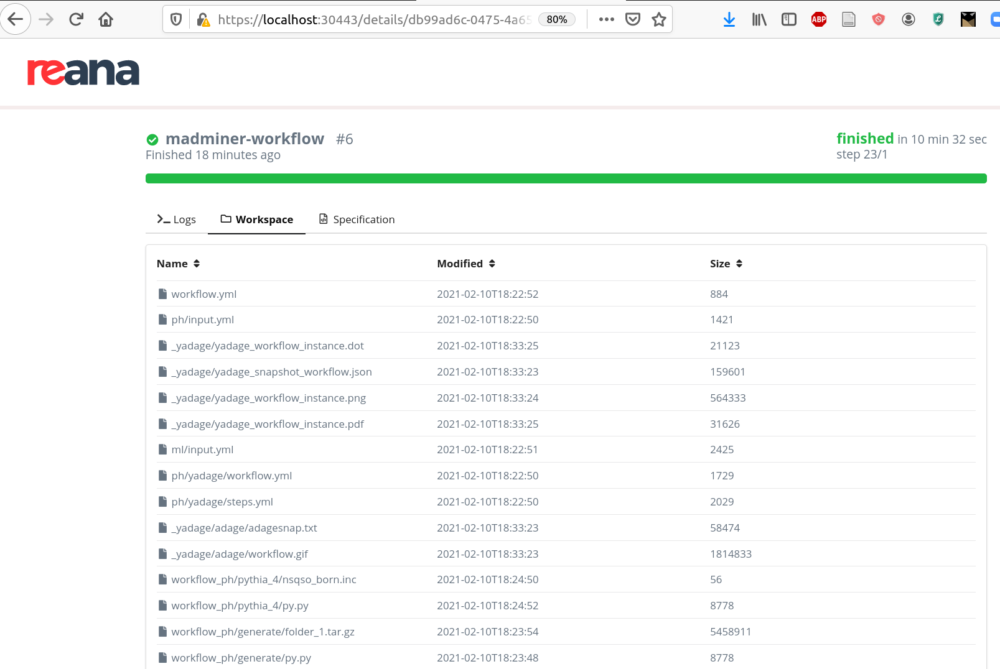
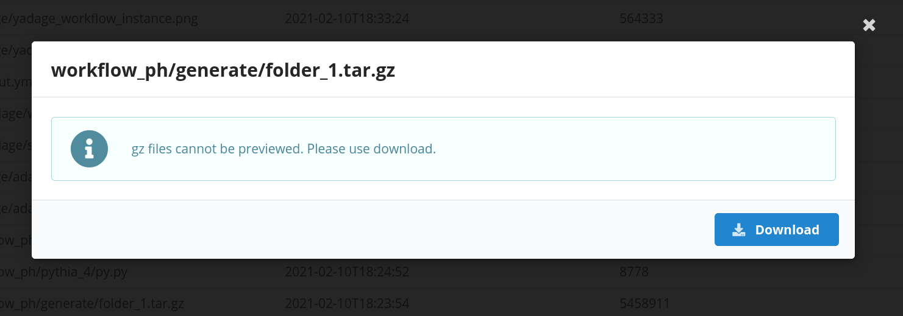
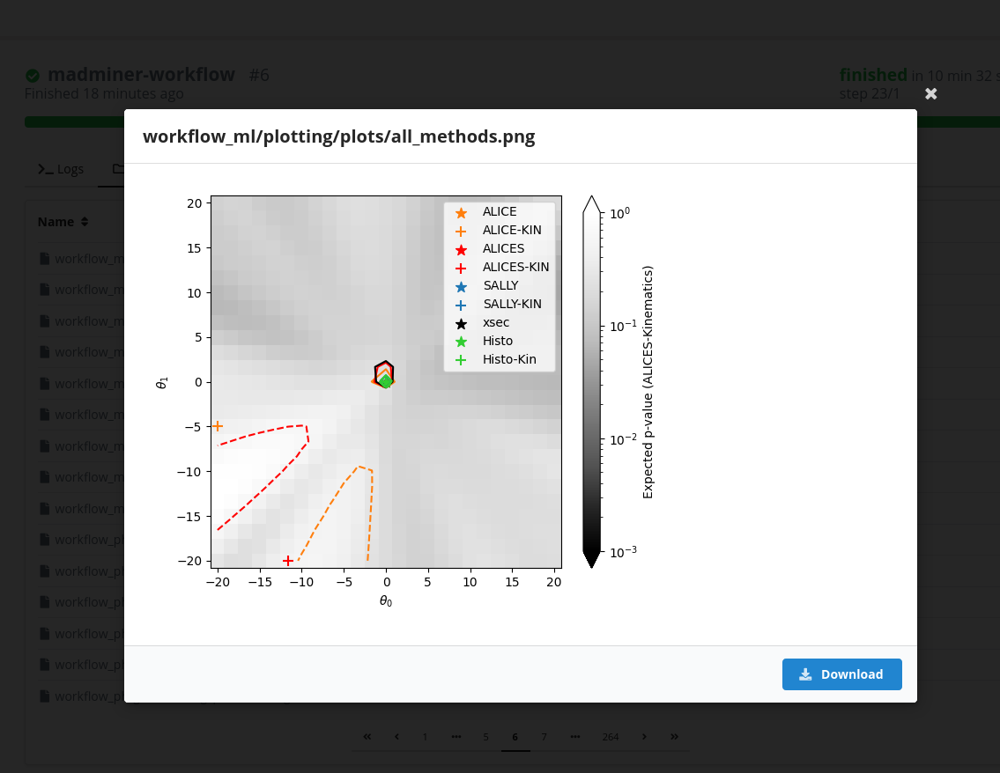
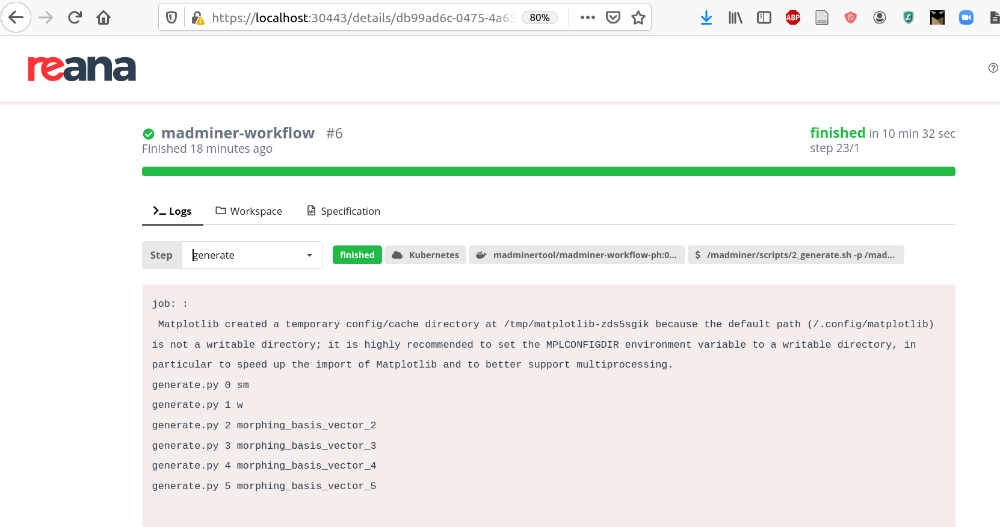

# Run remotely

This section describes the execution of the workflow on a REANA instance, being deployed on a remote cluster.
This section assumes that you have installed and configured the REANA client and, **optionally**, the MLFlow
tracking server as described in the [Setup REANA / MLFlow][reana-section-setup] section.

To determine if the connection is established check the following output

```bash
reana-client ping
> REANA server: <REANA_URL_SERVER>
> REANA server version: 0.7.1
> REANA client version: 0.7.2
> Authenticated as: <username> <username@institution>
> Status: Connected
```

The `Makefile` available in the [madminer-workflow][madminer-workflow-repo] repository defines a high-level command for
submitting jobs to a REANA cluster. To launch the workflow on a remote REANA instance, simply type:

```bash
make reana-run
```

You should see an output similar to this:

```
Copying sub-workflows...
Deploying on REANA...
madminer-workflow.1
File /ph/input.yml was successfully uploaded.
File /ph/yadage/steps.yml was successfully uploaded.
File /ph/yadage/workflow.yml was successfully uploaded.
File /ml/input.yml was successfully uploaded.
File /ml/yadage/steps.yml was successfully uploaded.
File /ml/yadage/workflow.yml was successfully uploaded.
File /workflow.yml was successfully uploaded.
madminer-workflow has been queued
```


## Monitor remote workflows
If you have access to a remote REANA server instance, it is more helpful to monitor the workflows and retrieve output files
from the local browser than from the working directory at the cluster’s institution. Here are the steps to take:

```bash
# Local terminal, SSH to the institution hosting the REANA server
ssh -q -L <port>:<REANA_SERVER_URL>:<port> <username>@<institution>
```

In the particular case of the _Brookhaven National Lab_, the REANA instance URL is available [here][reana-instance-bnl]
(IP protected). You can check the progress of your workflow on `https://localhost:30443` using your local browser.




## Example screenshots
The list of REANA workflows that have been submitted and their status:


The specification for one of the workflows:




The files produced in the workflow and stored in the workflow's workspace:




You can access individual files either from the web interface or with the `reana-client` CLI:




You can also directly view some files, like this plot:




You can also inspect the logs for different steps in the workflow:




In case you have an MLFlow tracking server running, you can view the metrics and artifacts being tracked:


[madminer-workflow-repo]: https://github.com/scailfin/madminer-workflow
[reana-instance-bnl]: https://kubmaster01.sdcc.bnl.gov:30443
[reana-section-setup]: 4_reana_setup.md
