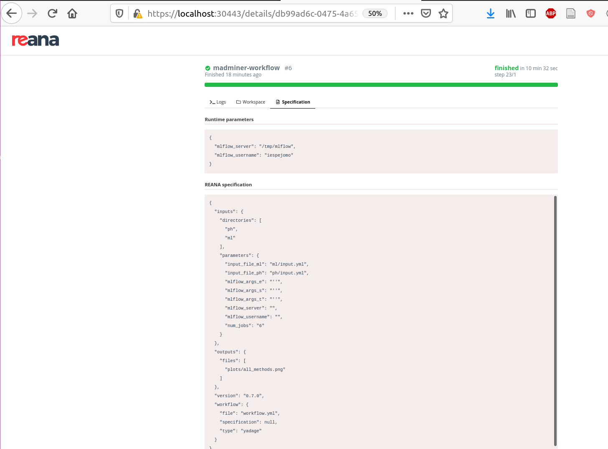
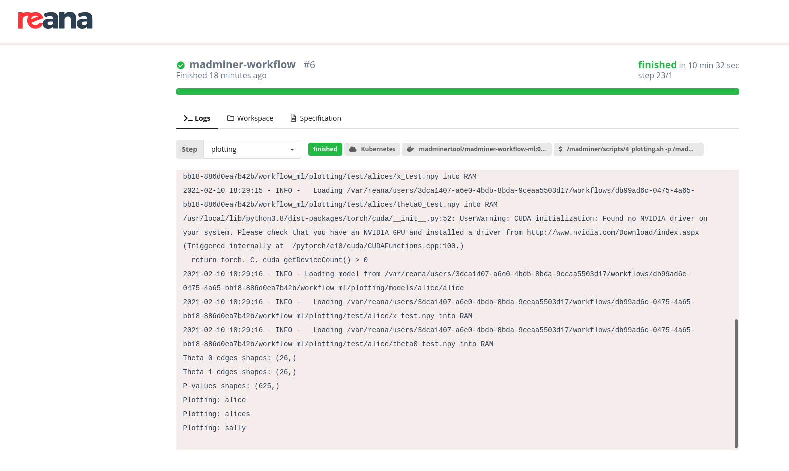
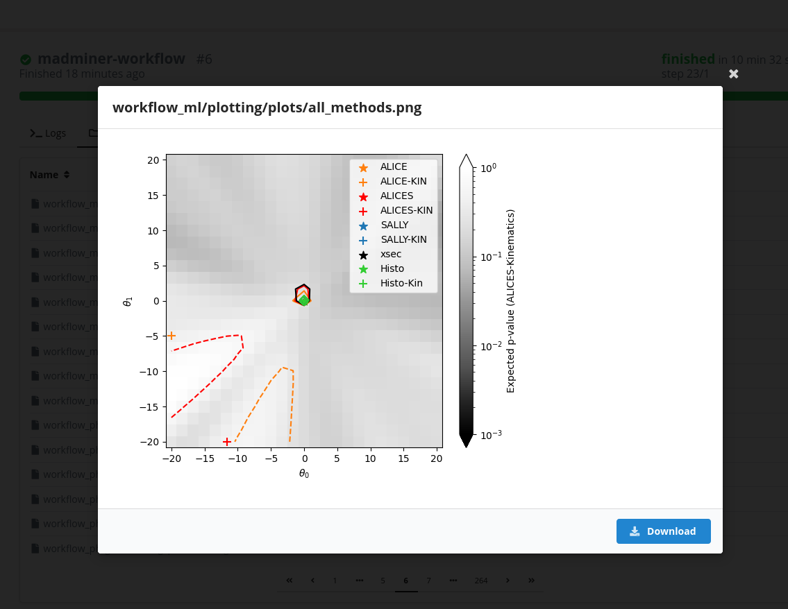

This section describes executing the workflow on a REANA instance running on a remote cluster. 
This section assumes that you have installed and configured the REANA client and the MLFlow tracking server as described [here](preliminaries).

To determine if the connection is established check the following output

```bash
reana-client ping
```
```
REANA server: <REANA_URL_SERVER>
REANA server version: 0.7.1
REANA client version: 0.7.2
Authenticated as: <username> <username@institution>
Status: Connected
```


The `Makefile` in the complete workflow repository  defines a high-level command for submitting the job to a REANA cluster (the sub-workflows do not). 
To launch the workflow on the remote REANA instance, simply type:

```bash
make reana-run
```

You should see an output similar to this 

```
Copying sub-workflows...
Deploying on REANA...
madminer-workflow.1
File /ph/input.yml was successfully uploaded.
File /ph/yadage/steps.yml was successfully uploaded.
File /ph/yadage/workflow.yml was successfully uploaded.
File /ml/input.yml was successfully uploaded.
File /ml/yadage/steps.yml was successfully uploaded.
File /ml/yadage/workflow.yml was successfully uploaded.
File /workflow.yml was successfully uploaded.
madminer-workflow has been queued
```

## Local monitoring of remote workflows

You can monitor the workflows and retrieve output files from your local browser by setting up a local monitor of the remote workflow than from the working directory at the cluster’s institution.  If you haven't already done it, follow the instructions [here](preliminaries.html#Local-monitoring-of-remote-workflows).

## Example screenshots

The list of REANA workflows that have been submitted and their status:


The specification for one of the workflows:


The files produced in the workflow and stored in the workflow's workspace


You can access individual files either from the web interface or with the `reana-client` CLI


You can also directly view some files, like this plot:



You can also inspect the logs for different steps in the workflow (eg. generate and plotting below)




And if you have an MLFlow tracking server runnning, you can view the metrics and artifacts being tracked


